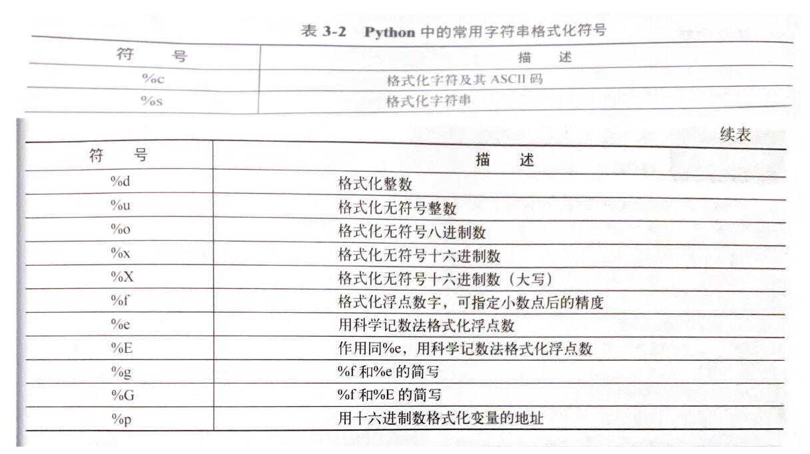

# Python-Fundamentals
这是一个python语法记录的存储库

## 目录
- [1.1 字符串](#1.1 [字符串](Basic_python_syntax/String))
- [1.2 运算符](#1.2)
- [使用方法](#使用方法)
- [贡献](#贡献)

## 第一章 [基础语法](Basic_python_syntax/)

### 1.1 [字符串](Basic_python_syntax/String)

常用的转义字符

常用字符串格式化符号

常用的字符串处理函数

  
### 1.2 [运算符](Basic_python_syntax/Calculation)

### 1.3 [条件语句](Basic_python_syntax/Conditional_Statements)

### 1.4 [循环语句](Basic_python_syntax/Loop_Statements)

### 1.5 [列表](Basic_python_syntax/List)

列表也称序列，是Python语言中最基本的一种数据结构，和其他编程语言（C/C++/Java）中的数组类似。

### 1.6 [元组](Basic_python_syntax/Tuple)

元组可以被看作一种特殊的列表。唯一与列表不同的是，元组内的数据元素不能发生改变。

### 1.7 [字典](Basic_python_syntax/Dictionary)

字典是一种比较特别的数据类型，字典中每个成员以“键:值”对的形式成对存在。字典与列表相比，最大的不同在于字典是无序的，其成员位置只是象征性的。在字典中通过键来访问成员，而不能通过其位置来访问该成员。

键值可以取任何数据类型。

### 1.8 [集合](Basic_python_syntax/Set)

集合（set）是一个无序不重复元素的序列。集合的基本功能是进行成员关系测试并删除重复元素。需要注意，创建空集合必须用函数set()实现。
